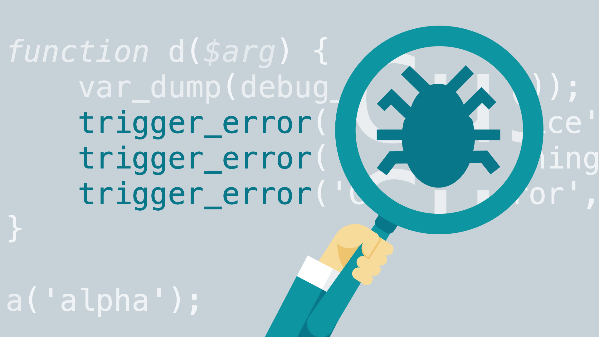

# Debugging in Ruby

## Refresher on Debugging

[Debugging in JS](../10-debugging-in-js/10-debugging-in-js.md)

## Clean Code Guidelines for Ruby

[Ruby Style Guide](https://github.com/bbatsov/ruby-style-guide)

## Exceptions

_An exception is a special kind of object, an instance of the class `Exception` or a descendant of that class that represents some kind of exceptional condition; it indicates that something has gone wrong._

In order to handle exceptions we need to introduce some new keywords:
- `raise` - raises an exception
- `begin` ... `end` - keywords that define context whereby we can rescue from
- `rescue` - captures an exception
- `ensure` - ensures behavior happens when catching exception

### Errors without Exception Handling

Handling errors up until now has looked something like this:

```ruby
def times_three(number)
  # this creates an exception
  return "Argument must be a number" unless number.is_a? Numeric

  number * 3
end

# this will return the string "Argument must be a number"
if output = times_three("orlando") # Argument must be a number
  puts output
end
```
The problem lies with the fact that we must write our code to handle the situation where the code returns a string and then display it to the console.

### Raise

_The raise keyword allows us to raise an error when something goes wrong_

```ruby
def times_three(number)
  # this creates an exception
  raise "Argument must be a number" unless number.is_a? Numeric

  number * 3
end

# the code will stop execution when it encounters the exception
# and will inform you in the console that an exception has occured
times_three("orlando") # Argument must be a number
```

### Begin ... End, Rescue

- _The `begin` keyword is one way we can indicate the beginning of when you want to check if an exception has occured_
- _The `end` statement ends the begin or definition clause_
- _The `rescue` clause allows us to check for when an error occurs and then do something with that information_

```ruby
def times_three(number)
  raise "Argument must be a number" unless number.is_a? Numeric

  number * 3
end

# indicates that this code _may_ run into an exceptional problem
begin
  times_three("orlando")
rescue
  # rescue allows us to rescue from the exception and do something
  # this something happens to be displaying back to the console the
  # words -> "I have been rescued"
  puts "I have been rescued"
end
```

We can also capture an exception as an object

```ruby
def times_three(number)
  raise "Argument must be a number" unless number.is_a? Numeric

  number * 3
end

begin
  times_three("orlando")
rescue => exception
  # this will display the message set in the exception
  puts exception.message

  # this will display the error stack trace
  puts exception.backtrace
end
```

Lastly, we can rescue from specific errors

```ruby
def times_three(number)
  # this will produce a Runtime error unless we specify
  raise "Argument must be a number" unless number.is_a? Numeric

  number * 3
end

begin
  times_three("orlando")
rescue RuntimeError => exception
  # capturing RuntimeError may not be ideal here since we only want
  # deal with the error that we set, look down below for the solution
  puts exception.message
end
```

It makes more sense to specify the exception type ourselves and rescue from that instead capturing general exceptions. Keep your rescues specific.

```ruby
def times_three(number)
  # this will produce a Runtime error unless we specify
  raise ArgumentError.new("Argument must be a number") unless number.is_a? Numeric

  number * 3
end

begin
  times_three("orlando")
rescue ArgumentError => exception
  # we want to make sure we ONLY rescue exceptions specifically
  # this avoid capturing exceptions that we want to be informed of normally
  puts exception.message
end
```

### Ensure

_The ensure clause allows us to execute behavior where or not an exception has occured_

```ruby
begin
  file = open("spartan-manifesto.txt", "w")
  file.write("This is sparta!")
rescue
  puts "Rescue me"
ensure
  # this code will run regardless of any exceptions occuring
  file.close
end
```

## Exceptions in Javascript

Javascript also has exception handling but suffers from some syntax woes

```js
try {
    myroutine(); // may throw three types of exceptions
} catch (e) {
    if (e instanceof TypeError) {
        // statements to handle TypeError exceptions
    } else if (e instanceof RangeError) {
        // statements to handle RangeError exceptions
    } else if (e instanceof EvalError) {
        // statements to handle EvalError exceptions
    } else {
       // statements to handle any unspecified exceptions
       logMyErrors(e); // pass exception object to error handler
    }
}
```

## Problems

How can we solve these problems?

### 1

```ruby
def allo
  "I am saying hello"
end

hello # undefined local variable or method `hello' for main:Object
```

### 2

```ruby
def subtract_6(x)
  x - 6
end

subtract_6("6") # undefined method `-' for "6":String
```

### 3

```ruby
times_three(number)
  number * 2
end

times_three(3) # 6
```

### 4

```ruby
class Dog
  HUMAN_AGE_MUTIPLIER = "15.0"

  def initialize(age, type)
    @type = type
    @age = age
    HUMAN_AGE_MUTIPLIER = 15
  end

  def type
    @tipe
  end

  def human_years
    @age * HUMAN_AGE_MUTIPLIER
  end
end

mr_dog = Dog.new("terrier", 3)
mr_dog.type

yo_dog = Dog.new("bulldog", 10)
mr_dog.human_years + yo_dog.human_years
```

## Resources

- [Honeybadger: A Beginner's Guide to Exceptions in Ruby](http://blog.honeybadger.io/a-beginner-s-guide-to-exceptions-in-ruby/)
- [Ruby Learning: Ruby Exceptions](http://rubylearning.com/satishtalim/ruby_exceptions.html)
- [MDN: Try...Catch](https://developer.mozilla.org/en-US/docs/Web/JavaScript/Reference/Statements/try...catch)

## Workshop

[Schoolhouse Automation](https://drive.google.com/open?id=1smPgw7SkWgoaFxQmGdxAgxBl8My3a41TynUEhOFvtzE)